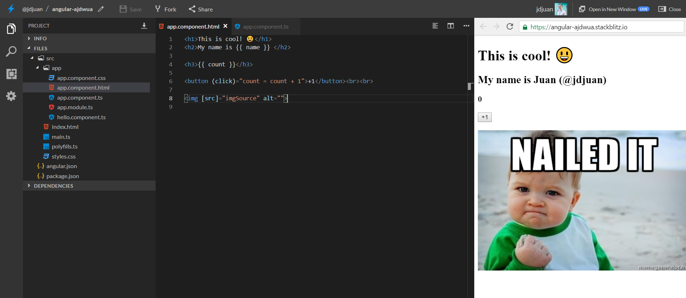

# Tu primera aplicación Angular

## 3. Property binding

Property binding nos permite asignar un valor a una propiedad de nuestro elemento HTML o component ✌️

Empecemos a usarlo 🖐:

1. Abre `app.component.html`  y cra una etiqueta **img** como esta: ``
2. Ninguna imagen se mostará porque nos falta el atributo `src`. En vez de agregarlo directamnete, vamos a usa property binding!
3. Abre el archivo`app.component.ts` y cra una variable nombrada **imageSource** y agrega el valos como el siguiente:

```typescript
imgSource = 'https://www.facevertizing.com/wp-content/uploads/2016/05/Nailed-It-Baby-Meme-06.jpg';
```

4. El paso final es actualizar la etiqueta **img**  con: ``

funcionó!? Coool 💪 ¡Eso es todo!😁



## Tu misión 

Crear una etiqueta `input` habilitar y deshabilitar el input con el click de un botón 

### Pistas:

1. No olvides que necesitas una variable para hacerlo funcionar, puedes llamarla: `disabled`
2. Usa la propiedad `[disabled]` del elemento`input` 
3. Usa el evento `click` para cambiar la variable!

Buena Suerte! 🤡🤡🤡

## Cuando termines, pasa a [la rama final](https://github.com/ltciro/your-first-angular-application/tree/4#your-first-angular-application)
