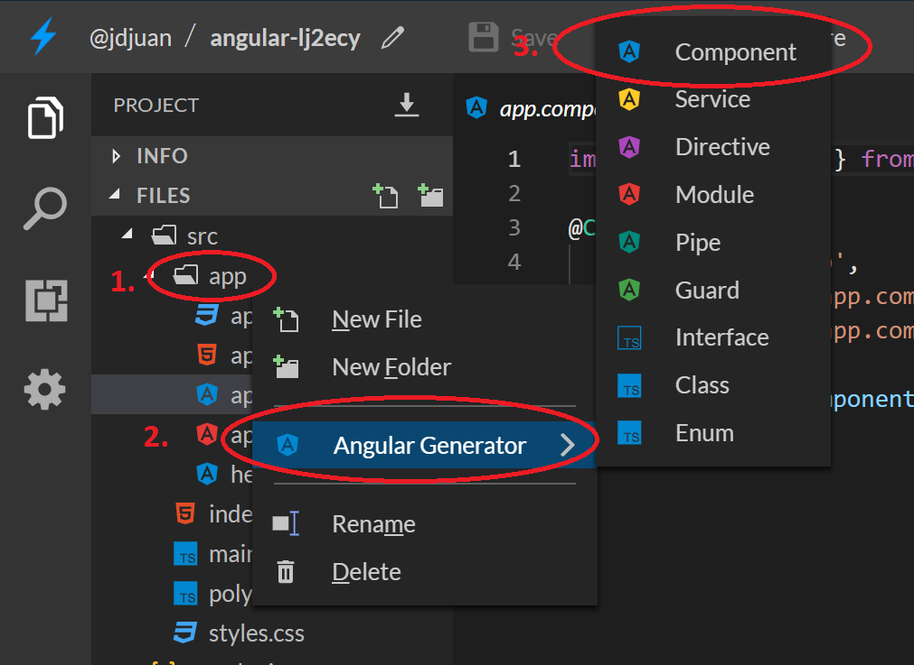

# Your First Angular Application

## 4. Component Creation

So we already applied a lot of concepts to our application, now it's time to go a little more in depth. Let's start creating our own component 📦.

In Stackblitz:

1. Right click in the `app` folder
2. Select `Angular Generator`
3. And then click `component`. Name it whatever you want. For example: `counter`



A component is generally composed of:

- 🔧 **Component:** `counter.component.ts`
- 🎨 **Styles:** `counter.component.css`
- 📱 **Template:** `counter.component.html`
- 📋 **Tests:** `counter.component.specs.ts`

> A component is a way to have a more maintanable application (i.e. this is very useful when you are app grows).

The **template** holds something like this by default:

```html
<p>counter works!</p>
```

1. Now, let's open our component: `counter.component.ts`
2. Pay attention to the selector tag, it should be something like: `app-counter`

> The `selector` is the tag you can use to render your component inside another template.

So now that we know our component tag we can use it inside our app component (**the original component we worked on**).

1. Go to `app.component.html` and add this at the bottom: `<app-counter></app-counter>`
2. Check your app in the browser! 💕
3. If you see at the bottom the **counter** component redenderd, then you nailed it! 💪

## Your mission! ⏳

Move the logic, the template, and the styles from the **app component** to the **counter component**.

### Tips 👇

1. The application should remain working
2. Migrate everything except the `<app-counter></app-counter>` tag, it is necessary to render the **counter** component

## You are done! 👏

You have created a super maintanable application! 👏👏👏

This is it! Thanks for holding on! See you soon!


